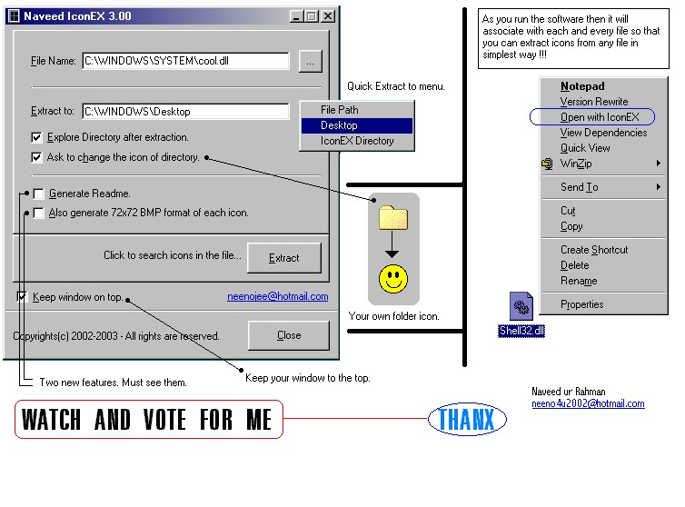



## ICON  EXTRACTOR With Amazing Features Specially Super Fast Speed \(Must See Preview\) \!\!\!

### Description

I extracted 100s of icons from shell32.dll, winword.exe, exel.exe, flash.exe, cool.dll, moricons.dll, pifmgr.dll and calculated time... Believe me, I was amazed because I do it all in only 15 seconds !!!. More over I have added some special features like changing the extracted Folder's icon, Writing a readme.txt file which contains all the file informations specially "ICON ALLOCATION" with which you can create some software that changes icon of "Self-Extractor of ZIP", Flash exe projector icon changer etc. Please Please Please VOTE FOR ME.

(IconEX 3.00 release on 2nd November 2002 - extract only 32x32 size of icons in resolution of 256 colors)
 
### More Info
 

             |
---                |---
**Submitted On**   |2002-11-02 15:06:46
**By**             |[Naveed ur Rahman](https://github.com/Planet-Source-Code/PSCIndex/blob/master/ByAuthor/naveed-ur-rahman.md)
**Level**          |Advanced
**User Rating**    |4.7 (109 globes from 23 users)
**Compatibility**  |VB 5\.0, VB 6\.0
**Category**       |[Coding Standards](https://github.com/Planet-Source-Code/PSCIndex/blob/master/ByCategory/coding-standards__1-43.md)
**World**          |[Visual Basic](https://github.com/Planet-Source-Code/PSCIndex/blob/master/ByWorld/visual-basic.md)
**Archive File**   |[ICON\_\_EXTR1491341132002\.zip](https://github.com/Planet-Source-Code/naveed-ur-rahman-icon-extractor-with-amazing-features-specially-super-fast-speed-must-see-__1-40374/archive/master.zip)

